```mermaid
flowchart TD
    A["🧾 Invoice Generated<br>(7 days before due)"] --> B["💳 Credit Card Processing<br>(4 days before due)"]
    B --> C["📩 First Friendly Reminder<br>(2 days before due)"]

    subgraph overdue["🚨 Overdue Reminders"]
        direction TB
        C1["📢 1 Day Overdue"]
        C2["📢 2 Days Overdue"]
        C3["📢 3 Days Overdue"]
    end
    C --> C1 --> C2 --> C3

    C3 --> D["â›” Service Suspension<br>(7 days overdue)"]
    D --> E["⌠Service Termination<br>(14 days overdue)"]

    subgraph recovery["🔄 Recovery Possible"]
        direction TB
        R1["💰 Make Payment Immediately"]
        R2["✅ Automated Data Restoration"]
    end

    subgraph no_recovery["âš ï¸ No Recovery"]
        direction TB
        X[""🛑 VPS is Deleted""]
    end

    E -.->|Invoice Status <b>Unpaid</b>| R1 --> R2
    E -.->|Invoice Status <b>Cancelled</b> <br> ~20 days past due date| X
```

## 🚀 Automated VPS Billing Workflow

This timeline shows when we send reminders, suspend services, terminate subscriptions, and finally delete VPS data if an invoice remains unpaid.

### ⏳ Timeline Overview

| Day | Event                 | Description                    |
| --- | --------------------- | ------------------------------ |
| -7  | 🧾 Invoice Created    | Invoice is issued              |
| -2  | 📩 Unpaid Reminder 1  | First reminder before due date |
| 0   | 📅 Due Date           | Invoice due                    |
| +1  | ⚠️ Overdue Reminder 1 | First overdue notice           |
| +2  | ⚠️ Overdue Reminder 2 | Second overdue notice          |
| +3  | ⚠️ Overdue Reminder 3 | Final overdue notice           |
| +7  | ⏸️ Suspend Service    | Service stops working          |
| +14 | ❌ Terminate Service   | Service agreement ends         |
| +20 | 🗑️ Delete VPS + Data | Server deletion                |

```
📅 Days:   -7     -2      0     +1     +2     +3     +7     +14     +20  
           |      |      |      |      |      |      |       |       |
Events:   IN─────+──────D───────+──────+──────S──────T───────DEL

Legend:
- IN  = 🧾 Invoice Created
- D   = 📅 Due Date
- S   = ⏸️ Suspend Service
- T   = ❌ Terminate Service
- DEL = 🗑️ Delete VPS + Data

Reminders:
- 📩 Unpaid Reminder (-2 days)
- ⚠️ Overdue Reminder 1 (+1 day)
- ⚠️ Overdue Reminder 2 (+2 days)
- ⚠️ Overdue Reminder 3 (+3 days)
```

## Automated VPS Billing Workflow

We want to provide you with a clear overview of our automated VPS billing process, including when we generate invoices, process credit card payments, send reminders, and what occurs if an invoice remains unpaid.

1. **Invoice Generation**

   * Generated 7 days before the due date

2. **Credit Card Processing**

   * Automated capture 4 days before the due date

3. **Payment Reminders**

   * First friendly reminder: 2 days before the due date

   * Overdue reminders: Sent 1, 2, and 3 days after the due date

4. **Service Actions**

   * **Service Suspension**: Occurs 3 days after the due date

   * **Service Termination**: Takes place 8 days after the due date (**all data is permanently wiped**)

***

## 🛠 Service Recovery Options

### **✅ If Your Invoice is Unpaid**


If your VPS was terminated but the invoice in your account is still **marked UNPAID** (and not cancelled), you **may** be able to restore your VPS.

#### Steps to Restore Your VPS

	1\.	**Make the payment immediately** (first step)

	2\.	**Contact Support**  to request data restoration  (after payment)


***

### **❌ If Your Invoice is Cancelled**

#### Service Recovery Not Available

	•	If your invoice is **marked CANCELLED**, **recovery is NOT possible**.

	•	Your VPS and **all data are permanently deleted**.

<Warning>
  **Service recovery is NOT possible after the invoice has been cancelled.**
  **Invoices are cancelled when VPS are finally deleted (8 to 10 days after termination).**
</Warning>


***

### **⏰** Billing Timeline Flowchart



***

<Note>
  ### **Client Responsibility Notice**

  VPS customers are solely responsible for:

  * Managing their virtual machines

  * Creating regular backups of their servers

  * Securing all important data

  EDIS Global strongly recommends maintaining current backups of all critical information.
</Note>