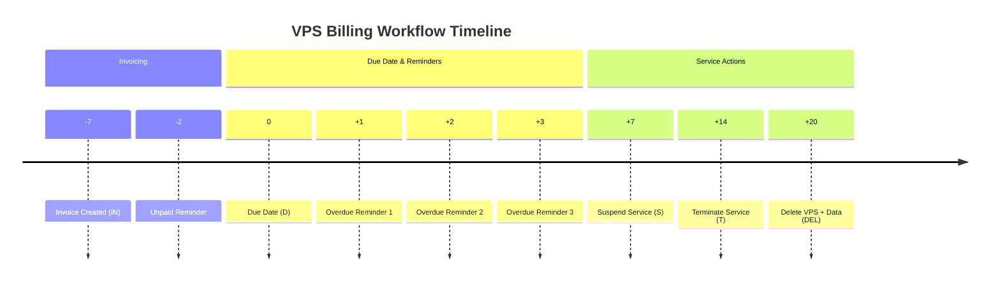

## 🚀 Automated VPS Billing Workflow

This timeline shows when we send reminders, suspend services, terminate subscriptions, and finally delete VPS data if an invoice remains unpaid.

### ⏳ Timeline Overview

| Day | Event                 | Description                    |
| --- | --------------------- | ------------------------------ |
| -7  | 🧾 Invoice Created    | Invoice is issued              |
| -2  | 📩 Unpaid Reminder 1  | First reminder before due date |
| 0   | 📅 Due Date           | Invoice due                    |
| +1  | ⚠️ Overdue Reminder 1 | First overdue notice           |
| +2  | ⚠️ Overdue Reminder 2 | Second overdue notice          |
| +3  | ⚠️ Overdue Reminder 3 | Final overdue notice           |
| +7  | ⏸️ Suspend Service    | Service stops working          |
| +14 | ❌ Terminate Service   | Service agreement ends         |
| +20 | 🗑️ Delete VPS + Data | Server deletion                |

Legend:
- IN   = Invoice Created
- D    = Due Date
- S    = Suspend Service
- T    = Terminate Service
- DEL  = Delete VPS + Data

Reminders:
- 📩 Unpaid Reminder (-2 days)
- ⚠️ Overdue Reminder 1 (+1 day)
- ⚠️ Overdue Reminder 2 (+2 days)
- ⚠️ Overdue Reminder 3 (+3 days)

## Automated VPS Billing Workflow

We want to provide you with a clear overview of our automated VPS billing process, including when we generate invoices, process credit card payments, send reminders, and what occurs if an invoice remains unpaid.

1. **Invoice Generation**

   * Generated 7 days before the due date

2. **Credit Card Processing**

   * Automated capture 4 days before the due date

3. **Payment Reminders**

   * First friendly reminder: 2 days before the due date

   * Overdue reminders: Sent 1, 2, and 3 days after the due date

4. **Service Actions**

   * **Service Suspension**: Occurs 3 days after the due date

   * **Service Termination**: Takes place 8 days after the due date (**all data is permanently wiped**)

***

## 🛠 Service Recovery Options

### **✅ If Your Invoice is Unpaid**&#xA;

If your VPS was terminated but the invoice in your account is still **marked UNPAID** (and not cancelled), you **may** be able to restore your VPS.

#### Steps to Restore Your VPS

&#x9;1\.	**Make the payment immediately** (first step)

&#x9;2\.	**Contact Support**  to request data restoration  (after payment)

***

### **❌ If Your Invoice is Cancelled**

#### Service Recovery Not Available

&#x9;•	If your invoice is **marked CANCELLED**, **recovery is NOT possible**.

&#x9;•	Your VPS and **all data are permanently deleted**.

<Warning>
  **Service recovery is NOT possible after the invoice has been cancelled.**
  **Invoices are cancelled when VPS are finally deleted (8 to 10 days after termination).**
</Warning>

***

### **⏰** Billing Timeline Flowchart

```mermaid
flowchart TD
    A["🧾 Invoice Generated<br>(7 days before due)"] --> B["💳 Credit Card Processing<br>(4 days before due)"]
    B --> C["📩 First Friendly Reminder<br>(2 days before due)"]

    subgraph overdue["🚨 Overdue Reminders"]
        direction TB
        C1["📢 1 Day Overdue"]
        C2["📢 2 Days Overdue"]
        C3["📢 3 Days Overdue"]
    end
    C --> C1 --> C2 --> C3

    C3 --> D["⛔ Service Suspension<br>(7 days overdue)"]
    D --> E["❌ Service Termination<br>(14 days overdue)"]

    subgraph recovery["🔄 Recovery Possible"]
        direction TB
        R1["💰 Make Payment Immediately"]
        R2["✅ Automated Data Restoration"]
    end

    subgraph no_recovery["⚠️ No Recovery"]
        direction TB
        X[""🛑 VPS is Deleted""]
    end

    E -.->|Invoice Status <b>Unpaid</b>| R1 --> R2
    E -.->|Invoice Status <b>Cancelled</b> <br> ~20 days past due date| X
```

***

<Note>
  ### **Client Responsibility Notice**

  VPS customers are solely responsible for:

  * Managing their virtual machines

  * Creating regular backups of their servers

  * Securing all important data

  EDIS Global strongly recommends maintaining current backups of all critical information.
</Note>