## Understanding EDIS Global's Automated VPS Billing Workflow

We want to provide you with a clear overview of our automated VPS billing process, including when we generate invoices, process credit card payments, send reminders, and what occurs if an invoice remains unpaid.

### Billing Timeline

```mermaid
flowchart TD
    A["🧾 Invoice Generated<br>(7 days before due)"] --> B["💳 Credit Card Auto-Capture<br>(4 days before due)"]
    B --> C["📩 First Friendly Reminder<br>(2 days before due)"]

    subgraph overdue["🚨 Overdue Reminders"]
        direction TB
        C1["📢 1 Day Overdue"]
        C2["📢 2 Days Overdue"]
        C3["📢 3 Days Overdue"]
    end
    C --> C1 --> C2 --> C3

    C3 --> D["⛔ Service Suspension<br>(3 days overdue)"]
    D --> E["❌ Service Termination<br>(8 days overdue - Data Wiped)"]

    subgraph recovery["🔄 Service Recovery (If Invoice NOT Cancelled)"]
        direction TB
        R1["💰 Make Payment"]
        R2["📞 Contact Support"]
        R3["✅ Possible Data Restoration"]
    end

    subgraph no_recovery["⚠️ No Data Recovery Possible (If Invoice Cancelled)"]
        direction TB
        X["🛑 Data Permanently Lost"]
    end

    E -.->|Invoice NOT Cancelled| R1 --> R2 --> R3
    E -.->|Invoice Cancelled| X
```

1. **Invoice Generation**
   - Generated 7 days before the due date
   
2. **Credit Card Processing**
   - Automated capture 4 days before the due date
   
3. **Payment Reminders**
   - First friendly reminder: 2 days before the due date
   - Overdue reminders: Sent 1, 2, and 3 days after the due date
   
4. **Service Actions**
   - Service Suspension: Occurs 3 days after the due date
   - Service Termination: Takes place 8 days after the due date (**all data is permanently wiped**)

### Service Recovery Options

If your VPS has been terminated, but your invoice is **not yet cancelled**, there may be an opportunity to restore your data. To attempt recovery:

1. Make the payment immediately
2. Contact our support team to notify us of your payment

**Important:** Once an invoice shows as "cancelled" in your account, data recovery is no longer possible.

<Note>
**Client Responsibility Notice**

VPS customers are solely responsible for:
- Managing their virtual machines
- Creating regular backups of their servers
- Securing all important data

EDIS Global strongly recommends maintaining current backups of all critical information.
</Note>