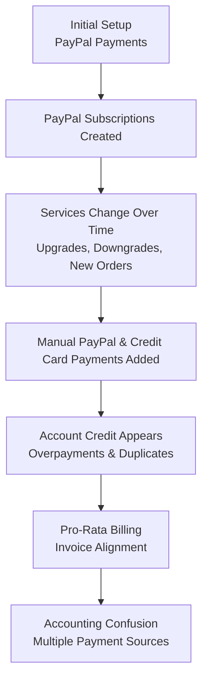

## Transition from Chaotic Payments to Automated Billing

As accounts grow over time, billing setups often evolve organically — and not always in a clean or predictable way.

Based on our experience with customers**over more than a decade** , we see a very typical pattern emerge as businesses scale.

This guide explains:

- how billing setups usually become complex,
- why this causes confusion for accounting,
- and how to safely transition to a **hassle-free, automated billing workflow**.

If you or your accountant feel that billing has become hard to follow, this guide is for you.

---

## A Typical Growth Path (What Usually Happens)

Many accounts start simple and become more complex over time.

### What this looks like in practice

- Services are initially paid via **PayPal**
- Customers sign up for **PayPal subscriptions**
- Subscriptions keep sending the **same recurring amount**, even if services change
- Over time, customers also make **manual PayPal or credit card payments**
- Forgotten PayPal subscriptions continue to send funds
- Duplicate payments are added to **account credit**
- Account credit is applied automatically to invoices
- Accounting visibility decreases as services grow

---

## First Check: Review Your Account Credit Balance

If you see account credit that you did **not intentionally add**, this is often caused by:

- active or forgotten PayPal subscriptions
- overlapping manual payments

---

## The Most Important Step: Cancel PayPal Subscriptions

Before doing anything else, review your PayPal account and cancel all active subscriptions.

https://docs.edisglobal.com/faq/billing-lifecycle/how-to-locate-and-cancel-a-subscription-in-your-paypal-account

This ensures no automated payments continue to arrive unexpectedly.

---

## Understanding Account Credit During the Transition

Account credit is applied automatically to new invoices and can also be used for new orders.

https://docs.edisglobal.com/faq/billing-lifecycle/pay-invoices-from-credit-balance

---

## You Are Already Halfway There

Once PayPal subscriptions are cancelled and account credit is being reduced intentionally, you are already more than halfway toward a clean billing setup.

https://docs.edisglobal.com/faq/billing-lifecycle/automated-billing

---

## The Transition Phase: What to Watch Closely

- Monitor invoices carefully
- Watch for the point where remaining credit is fully used
- Activate automated billing before invoices become overdue

---

## Moving to SEPA Direct Debit (Optional)

SEPA Direct Debit should be prepared in advance.

- Create a small account credit top-up (e.g. €5)
- Choose SEPA Direct Debit as payment method
- Complete mandate setup
- Contact support after settlement, move services to the new payment method

Important notes:

- Not suitable for instant delivery
- Services activate after settlement (4–5 days)
- Pay all existing invoices manually before switching

---

## Optional: Locking Account Credit During Billing

EDIS Global can lock account credit during the billing window to avoid automatic application.

https://docs.edisglobal.com/faq/billing-lifecycle/scheduled-billing-window

---

## We Are Happy to Help

If your billing setup has grown complex, our team is happy to help you transition to a clean, automated workflow.