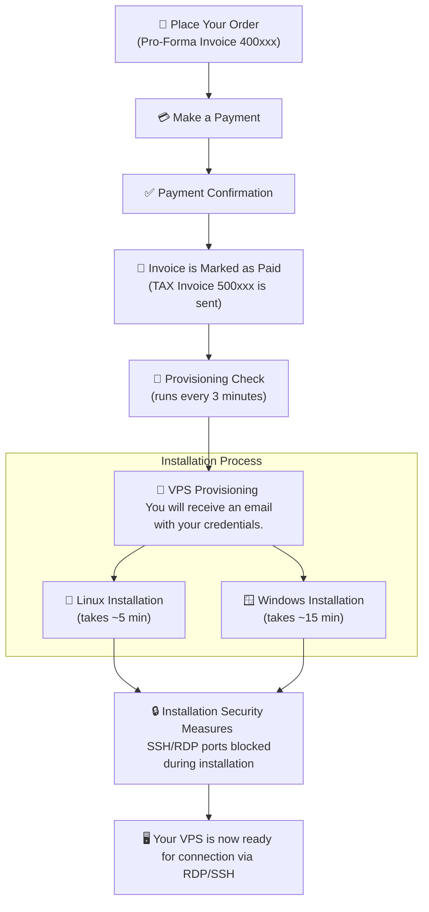

## **How Fast Do You Deliver My VPS Order?**

EDIS Global wants to ensure a great experience for all of its customers.  In order to successfully welcome new clients, there are some essential checks that need to be completed.

### **Instant VPS Deployment**

**VPS servers are deployed instantly ⚡ after payment confirmation.**

Linux systems are typically ready within **5 minutes**, while Windows deployments may take up to 15 minutes to install.

For crypto payments, provisioning begins once the required **blockchain confirmations** are completed. You will receive a payment confirmation once this process is finished.

**Provisioning starts immediately after payment is confirmed.**

​	•	**PayPal & Credit Cards**: **near-realtime ⚡**

​	•	**Crypto Payments**: Subject to blockchain confirmations

Once **payment clears**, your server is **delivered instantly**.

```mermaid
flowchart TD
    A["🛒 Place Your Order<br>(Pro-Forma Invoice 400xxx)"] --> B["💳 Make a Payment"]
    B --> C["✅ Payment Confirmation"]
    C --> D["📜 Invoice is Marked as Paid<br>(TAX Invoice 500xxx is sent)"]
    D --> E["🔄 Provisioning Check<br>(runs every 3 minutes)"]
    E --> F["🚀 VPS Provisioning <br> You will receive an email with your credentials."]

    subgraph "🖥️ Installation Process" [Installation Process]
        direction TB
        F --> G["🐧 Linux Installation <br>(takes ~5 min)"]
        F --> H["🪟 Windows Installation <br> (takes ~15 min)"]
    end

    G & H --> I["🔒 Installation Security Measures <br> SSH/RDP ports blocked during installation"]
    I --> J["🖥 Your VPS is now ready for connection via RDP/SSH"]
```

### When things take longer than expected

In some rare occasions, we can't deliver your order right away. It can be a temporary resource-shortage, or the need to fulfill further compliance checks. EDIS Global team would reach out to you for additional information (if required), or offer a refund.