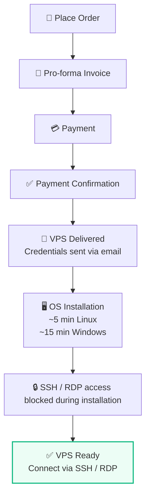

## How fast is VPS delivery?

**VPS servers are deployed instantly ⚡ after payment confirmation.**

- **Linux**: ready in ~5 minutes
- **Windows**: may take up to ~15 minutes

For crypto payments, provisioning begins once the required **blockchain confirmations** are completed.

**Provisioning starts immediately after payment is confirmed.**

- **PayPal & Credit Cards**: near-realtime ⚡
- **Crypto Payments**: depends on blockchain confirmations

**Once payment clears, your server is delivered instantly.**

```mermaid
flowchart TD
    A["🛒 Place Order"] --> B["📄 Pro-forma Invoice"]
    B --> C["💳 Payment"]
    C --> D["✅ Payment Confirmation"]
    D --> E["🚀 VPS Delivered<br/>Credentials sent via email"]
    E --> F["🖥️ OS Installation<br/>~5 min Linux <br/> ~15 min Windows"]
    F --> G["🔒 SSH / RDP access blocked during installation"]
    G --> H["✅ VPS Ready<br/>Connect via SSH / RDP"]

    classDef highlight fill:#ecfdf5,stroke:#10b981,stroke-width:2px;
    class H highlight;
```

### When delivery may take longer

In rare cases, delivery may be delayed due to:

- temporary resource shortages
- additional compliance checks

If required, our team will contact you or offer a refund.