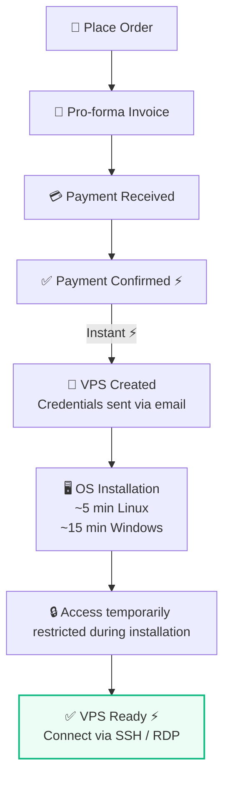

**Instant deployment ⚡ after payment confirmation.**

## Deployment speed

- **Linux**: ready in ~5 minutes
- **Windows**: may take up to ~15 minutes

## Payment methods

Deployment begins as soon as your payment is confirmed:

- **PayPal & Credit Cards**: near-realtime ⚡
- **Crypto Payments**: starts after required blockchain confirmations

---

## Delivery process

```mermaid
flowchart TD
    A["🛒 Place Order"] --> B["📄 Pro-forma Invoice"]
    B --> C["💳 Payment Received"]
    C --> D["✅ Payment Confirmed ⚡"]
    D -->|Instant ⚡| E["🚀 VPS Created<br/>Credentials sent via email"]
    E --> F["🖥️ OS Installation<br/>~5 min Linux <br/> ~15 min Windows"]
    F --> G["🔒 Access temporarily restricted during installation"]
    G --> H["✅ VPS Ready ⚡<br/>Connect via SSH / RDP"]

    classDef highlight fill:#ecfdf5,stroke:#10b981,stroke-width:2px;
    class H highlight;
```

---

## When delivery may take longer

In rare cases, delivery may be delayed due to:

- temporary resource shortages
- additional compliance checks

If required, our team will contact you or offer a refund.