## How fast do you deliver my VPS order?

EDIS wants to ensure a great experience for all of its customers.&#x20;
In order to successfully welcome new clients, there are some essential checks that need to be completed.

### &#xA;Instant delivery

EDIS delivers VPS hosting plans instantly. Your virtual server will be delivered right after the payment has cleared, which typically takes **6 confirmations on the blockchain** (till our payment processor Coinbase Commerce reports the payment to us) and less than 2 minutes through PayPal and Credit Cards, or through payments with account credit.

Once the **payment has cleared**, your server will be **delivered** **instantly**.

### What, if it takes longer ...

In some rare occasions, we can't deliver your order right away and need to fulfill further compliance checks. EDIS team would reach out to you for additional information, or offer a refund.

```mermaid
flowchart TD
    A["🛒 Customer places order<br>(Pro-forma Invoice 400xxx)"] --> B["💳 Customer makes payment"]
    B --> C["✅ Payment provider confirms"]
    C --> D["📜 Invoice converted<br>(Tax Invoice 500xxx)"]
    D --> E["🔄 Provisioning checks for paid orders<br>(Every 3 min)"]
    E --> F["🚀 VPS provisioned & credentials sent"]

    subgraph "🖥️ Installation Process" [Installation]
        direction TB
        F --> G["🐧 Linux install (~5 min)"]
        F --> H["🪟 Windows install (~15 min)"]
    end

    G & H --> I["🔒 SSH/RDP ports blocked during installation"]
```

