## **How Fast Do You Deliver My VPS Order?**

EDIS Global wants to ensure a great experience for all of its customers. 
In order to successfully welcome new clients, there are some essential checks that need to be completed.

### 
**Instant VPS Deployment**

EDIS Global provisions VPS hosting within **3 minutes** after payment confirmation.

​	•	**PayPal & Credit Cards**: Near-instant processing

​	•	**Crypto Payments**: Subject to blockchain confirmations

Once **payment clears**, your server is **delivered instantly**.

```mermaid
flowchart TD
    A["🛒 Place Your Order<br>(Pro-Forma Invoice 400xxx)"] --> B["💳 Make a Payment"]
    B --> C["✅ Payment Confirmation"]
    C --> D["📜 Invoice is Marked as Paid<br>(TAX Invoice 500xxx is sent)"]
    D --> E["🔄 Provisioning Check<br>(runs every 3 minutes)"]
    E --> F["🚀 VPS Provisioning <br> You will receive an email with your credentials."]

    subgraph "🖥️ Installation Process" [Installation Process]
        direction TB
        F --> G["🐧 Linux Installation <br>(takes ~5 min)"]
        F --> H["🪟 Windows Installation <br> (takes ~15 min)"]
    end

    G & H --> I["🔒 Installation Security Measures <br> SSH/RDP ports blocked during installation"]
    I --> J["🖥 Your VPS is now ready for connection via RDP/SSH"]
```

### What, if it takes longer ...

In some rare occasions, we can't deliver your order right away and need to fulfill further compliance checks. EDIS team would reach out to you for additional information, or offer a refund.