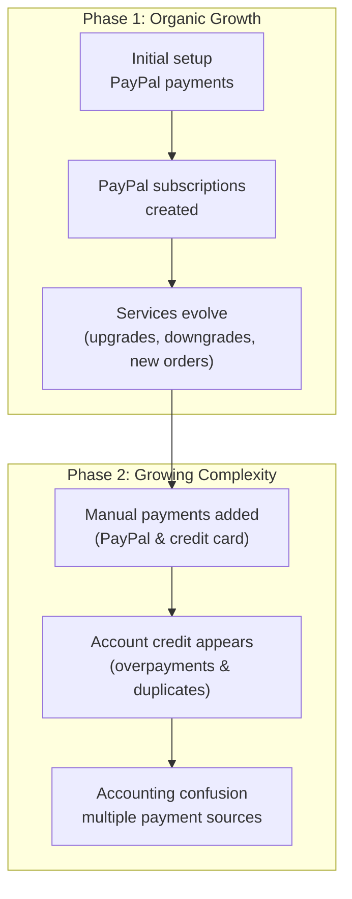

## Transition from chaotic payments to automated payments

As accounts grow over time, payment setups often evolve organically, and not always in a clean or predictable way.

Based on our experience with customers **over more than a decade**, we see a very typical pattern emerge as businesses scale.

This guide explains:

- how payment setups usually become complex,
- why this causes confusion for accounting,
- and how to safely transition to a **hassle-free, automated payment workflow**.

If you or your accountant feel that payments have become hard to follow, this guide is for you.

---

## A typical growth path (what usually happens)

Many accounts start simple and become more complex over time.

### What this looks like in practice

- Services are initially paid via **PayPal**
- Customers sign up for **PayPal subscriptions**
- Subscriptions keep sending the **same recurring amount**, even if services change
- Over time, customers also make **manual PayPal or credit card payments**
- Forgotten PayPal subscriptions continue to send funds
- Duplicate payments are added to **account credit**
- Account credit is applied automatically to new invoices
- Accounting visibility decreases as services grow

---

## First check: review your account credit balance

If you see account credit that you did **not intentionally add**, this is often caused by:

- manual payments, overlapped by 
- active or forgotten PayPal subscriptions

---

## The most important step: cancel PayPal subscriptions

Before doing anything else, review your PayPal account and cancel all active subscriptions.

https://docs.edisglobal.com/faq/billing-lifecycle/how-to-locate-and-cancel-a-subscription-in-your-paypal-account

This ensures no automated payments continue to be sent unexpectedly. EDIS Global is not charging your PayPal account. PayPal is repeatedly sending payments to us.

---

## Understanding account credit during the transition

Account credit is applied automatically to new invoices and can also be used for new orders. Your credit balance is displayed in the control panel.

https://docs.edisglobal.com/faq/billing-lifecycle/pay-invoices-from-credit-balance

---

## You are already halfway there

Once PayPal subscriptions are cancelled and account credit is being reduced intentionally, you are already more than halfway toward a clean payment setup.

https://docs.edisglobal.com/faq/billing-lifecycle/automated-payments 

---

## The transition phase: what to watch closely

- Monitor invoices carefully
- Watch for the point where remaining credit is fully used
- Activate automated payment methods before invoices become overdue

---

## Moving to SEPA or ACH Direct Debit (invitation only)

SEPA and ACH Direct Debit are available only to approved customers. Contact EDIS Global Support first to confirm eligibility and arrange mandate setup. Do not assume that Direct Debit is available in every account.

After support confirms that your account is eligible:

1. Create the small account-credit top-up requested for the mandate setup.
2. Select the available SEPA or ACH Direct Debit payment method.
3. Complete the mandate setup.
4. Contact support after settlement to arrange the agreed payment workflow for your services.

Important notes:

- Not suitable for instant delivery
- Settlement may take several business days
- Pay all existing invoices manually before switching
- Continue using your existing payment method until support confirms that the mandate and new payment workflow are active

---

## Optional: locking account credit during billing

For approved accounts, EDIS Global can lock account credit during the billing window to avoid automatic application. This can be useful when combining Direct Debit with account credit. Renewal invoices are collected through the agreed Direct Debit workflow, while the account credit balance remains available for new purchases with near real-time delivery.

https://docs.edisglobal.com/faq/billing-lifecycle/scheduled-billing-window

---

## We are happy to help

If your billing setup has grown complex, our team is happy to help you transition to a clean, automated workflow.
